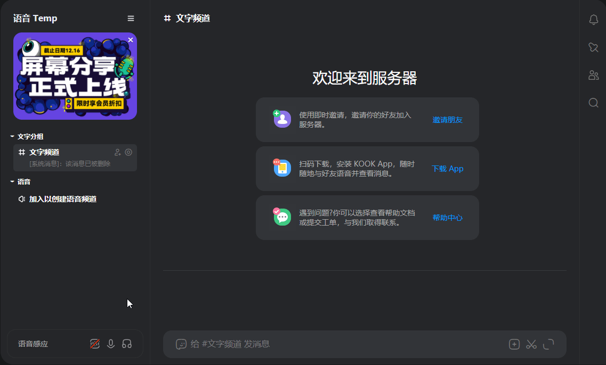

  
# <a>语音</a> <a class="gradient-2">Temporary</a>

 > <a class="gradient-1"><b>语音频道</b>新范式</a>

- **语音 Temp** 通过为用户创建临时的语音频道, 使你的 KOOK 服务器焕然一新
- 想要有足够多的频道容纳用户的各种需求? 您不必手动创建了

[快速开始](/quick-start)
[邀请至服务器](https://www.kookapp.cn/app/oauth2/authorize?id=13851&permissions=51231800&client_id=Yc_D002vsARZTTzP&redirect_uri=&scope=bot)
[控制面板](/ ':disabled')
